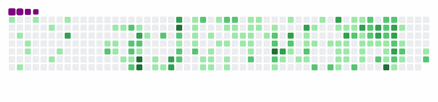

# 👋 Hey there, I’m Prabrisha Das - aka PD!

🌸 Aspiring Developer | 🐍 Python Learner | 💻 Tech Explorer  

## 💫 About Me

Hi! I'm currently diving into the beautiful chaos of code, one step at a time. 
I’ve started my journey with **Python** and slowly exploring the magic of **Frontend Web Development** with **HTML & CSS**.  

I’m currently focused on:
- 🐍 Building a strong foundation in **Python**
- ☕ Revisiting **Java** to sharpen my OOP skills

Coming up next:
- 🎨 Learning the holy **Frontend Trinity** — HTML, CSS, and JavaScript  
- 🧪 Working on fun beginner-friendly projects to apply my skills  
- 🚀 Keep growing, building, and discovering the tech world one project at a time

*"I may be new to coding, but I’m already in love with what it can do."*

<h3> Find Me Here </h3>

<a href="https://www.leetcode.com/prabrishadas"><picture><source media="(prefers-color-scheme: dark)" srcset="assets/findme/leetcode_dark.png" /><source media="(prefers-color-scheme: light)" srcset="assets/findme/leetcode_light.png" /></picture></a>

<h3> Tech Stack </h3>

## GitHub Stats 

<picture>
  <source media="(prefers-color-scheme: dark)" srcset="https://github-readme-stats.vercel.app/api/top-langs/?username=Pdas2506&theme=radical&hide_border=false&show_icons=true&border_radius=25&layout=compact" />
  <source media="(prefers-color-scheme: light)" srcset="https://github-readme-stats.vercel.app/api/top-langs/?username=Pdas2506&theme=buefy&hide_border=false&show_icons=true&border_radius=25&layout=compact&border_color=a8a8a8" />
  
</picture> 
<picture>
  <source media="(prefers-color-scheme: dark)" srcset="https://github-readme-stats.vercel.app/api?username=Pdas2506&theme=radical&hide_border=false&show_icons=true&border_radius=25" />
  <source media="(prefers-color-scheme: light)" srcset="https://github-readme-stats.vercel.app/api?username=Pdas2506&theme=buefy&hide_border=false&show_icons=true&border_radius=25&border_color=a8a8a8" />
  
</picture> 
<picture>
  <source media="(prefers-color-scheme: dark)" srcset="https://github-readme-streak-stats.herokuapp.com/?user=Pdas2506&theme=radical&border_radius=25" />
  <source media="(prefers-color-scheme: light)" srcset="https://github-readme-streak-stats.herokuapp.com/?user=Pdas2506&theme=buefy&border_radius=25&border_color=a8a8a8" />
  
</picture> 

## GitHub Trophies 

<picture>
    <source media="(prefers-color-scheme: dark)" srcset="https://github-profile-trophy.vercel.app/?username=Pdas2506&theme=radical&no-frame=false&no-bg=false&margin-w=10" />
    <source media="(prefers-color-scheme: light)" srcset="https://github-profile-trophy.vercel.app/?username=Pdas2506&theme=default&no-frame=false&no-bg=false&margin-w=10&border_color=a8a8a8" />
    
</picture>

<h3> A cute little Animation I found.. because, why not? </h3>

<picture>
  <source media="(prefers-color-scheme: dark)" srcset="assets/animations/snake_dark.svg" />
  <source media="(prefers-color-scheme: light)" srcset="assets/animations/snake_light.gif" />
  
</picture>

<h1></h1>

"<i>Learning to code one bug at a time — but always with a smile </i>😊”

